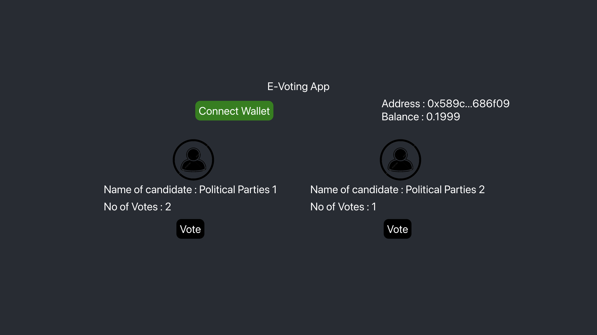

# ChainProofV2: Elevating Document Storage with Blockchain and React

## Introduction
ChainProofV2 is the next-level solution for document storage, leveraging the power of blockchain and React. This program redefines security, permanence, and accessibility in document management.

## Key Benefits
- **Robust Security:** Utilize blockchain cryptography to safeguard documents against unauthorized access and tampering.
- **Immutable Integrity:** Ensure document integrity by anchoring each document in the blockchain.
- **Effortless Verification:** Verify document authenticity through unique digital fingerprints.
- **User-Centric Design:** Enjoy an intuitive user interface for easy navigation.
- **Decentralized Resilience:** Eliminate single points of failure with decentralized storage.

## Workflow with React
1. **Seamless Upload:** Effortlessly upload documents via the intuitive React interface.
2. **Blockchain Integration:** Integrate document cryptographic signatures into the blockchain for immutability.
3. **Instant Access:** Retrieve documents and verify authenticity by comparing signatures.
4. **Decentralized Assurance:** Leverage decentralized nodes for reliable and resilient document storage.

## Getting Started
To start with ChainProofV2, follow these steps:
1. Clone the repository: `git clone https://github.com/waseem0605/ChainProofV2.git`
2. Navigate to the project: `cd ChainProofV2`
3. Install dependencies: `npm install`
4. Launch the app: `npm start`

## Embrace React's Power
ChainProofV2 operates under the [MIT License](https://github.com/waseem0605/ChainProofV2/blob/main/LICENSE), allowing you to modify, adapt, and distribute the code as per the license terms.

Experience the future of document storage with ChainProofV2! Explore the [ChainProofV2 GitHub Repository](https://github.com/waseem0605/ChainProofV2) and become a catalyst for change.
